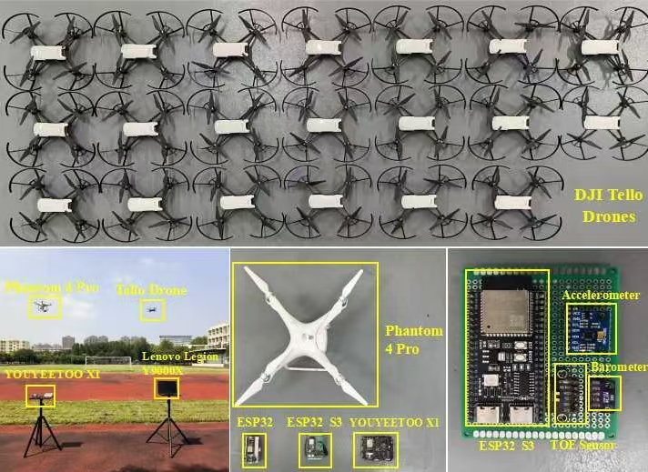

# SecureLink Dataset

## Introduction

The SecureLink dataset presents synchronized **channel state information \(CSI\)** and **inertial sensor measurements** collected from 22 UAV platforms: twenty DJI Tello drones \(IDs 00–19\) and two ESP32\-based platforms \(IDs 20–21\) rigidly mounted on a DJI Phantom 4 Pro\.

Over more than twelve hours of flight experiments across multiple days, data was captured under **four distinct environmental conditions**:

- Rooftop \(trials 1–5\)

- Playground \(trials 6–10\)

- Corridor \(trials 11–15\)

- Office \(trials 16–20\)

Dynamic maneuvers \(ascend, descend, left, right, yaw rotation\) were applied to the drones during flights\. Five additional static trials \(labels 21–25\) were conducted in the office setting with UAVs powered on but propellers deactivated\.

---
## Hardware Setup

> *Figure 1: Overall experimental hardware platform. Top: 20 DJI Tello UAVs; Bottom left: flight field layout with Phantom 4 Pro carrier; Bottom middle: Phantom 4 Pro main carrier UAV; Bottom right: ESP32 onboard sensor acquisition board with accelerometer and barometer modules.*

## Dataset Structure

The merged dataset is distributed as a single Excel file \(SecureLink`.xlsx`\) containing two independent sheets:

|Sheet Name|Content|Approx\. Rows|Columns|Description|
|---|---|---|---|---|
|**CSI Data**|WiFi channel state information \+ 802\.11 frame headers|\~220,000|323|Each row corresponds to one CSI capture frame, standardized to 20MHz bandwidth|
|**Sensor Data**|UAV IMU and flight status data|\~250,000|18|Each row corresponds to one sensor sample record|

> **Bandwidth note**: Devices 00–19 are native 20MHz captures\. Devices 20–21 were originally captured at 80MHz bandwidth; the center 20MHz subcarrier band \(\-26 \~ \+26\) has been extracted and aligned for consistency across all devices\. Subcarrier indices are fully uniform across all 22 devices\.
> 
> 


## Data Collection

### Hardware

- **Main carrier**: DJI Phantom 4 Pro

- **WiFi devices \(00–19\)**: DJI Tello drones \(20 units\)

- **WiFi devices \(20–21\)**: ESP32\-based platforms \(2 units, 80MHz bandwidth\)

- **CSI acquisition**: PicoScenes framework

- **Sensors**: Onboard IMU \+ barometer \+ TOF rangefinder

### Scenarios \& Maneuvers

|Scenario|Trial IDs|Environment Type|
|---|---|---|
|Rooftop|1–5|Open outdoor, strong LOS|
|Playground|6–10|Open outdoor, moderate multipath|
|Corridor|11–15|Narrow indoor, rich multipath|
|Office|16–20|Cluttered indoor, dense multipath|
|Office \(Static\)|21–25|Static baseline control group; UAVs remain powered on with propellers deactivated|

Dynamic maneuvers include vertical movement \(up/down\), horizontal translation \(left/right\), and yaw rotation\.

---

## Field Description

### 1\. CSI Data Sheet \(323 columns\)

CSI recordings were obtained via PicoScenes\. The full channel matrix, subcarrier indices, magnitude, and phase information are preserved for comprehensive channel characterization\. In our channel variation studies, we primarily utilize phase\-difference information derived from the raw CSI matrix\. **Detailed metadata specifications are available per the official PicoScenes documentation for users requiring extended analyses\.**

#### 1\.1 Time \& Identifier Fields \(4 columns\)

|Column Name|Type|Description|
|---|---|---|
|device_id |string|Device identifier, two\-digit format \(00\~21\), used to distinguish different UAV platforms|
|CSI_SystemTime_ns|numeric|Host\-side system timestamp in nanoseconds, high\-precision time alignment reference|
|CSI_BJ_Time |datetime|Beijing time in human\-readable format, converted from SystemTime|
|CSI_Timestamp|numeric|NIC hardware\-side timestamp in microseconds|

#### 1\.2 RxSBasic — Receive Basic Information \(21 columns\)

Basic WiFi receiver RF parameters:

- **DeviceType**: Device type ID, distinguishes NIC models \(AX210/AX200/QCA9300/IWL5300/USRP, etc\.\)

- **Timestamp**: Microsecond\-level hardware timestamp

- **SystemTime**: Host\-side system timestamp

- **CenterFreq**: Receive channel center frequency, in MHz

- **ControlFreq**: 20 MHz control channel center frequency, in MHz

- **CBW**: Channel bandwidth, supports 20/40/80/160, etc\.

- **PacketFormat**: Packet format: NonHT/HT/VHT/HE\-SU/HE\-MU

- **PacketCBW**: Actual bandwidth occupied by this packet

- **GI**: Guard interval

- **MCS**: MCS index, interpreted together with PacketFormat for data rate

- **NumSTS**: Number of Space\-Time Streams \(STS\)

- **NumESS**: Number of Extra Spatial Streams \(ESS\)

- **NumRx**: Number of receive chains/antennas/RF chains

- **NoiseFloor**: Noise floor

- **RSSI**: Overall received signal strength indicator

- **RSSI1 \~ RSSI8**: Independent RSSI value for each receive chain

#### 1\.3 StandardHeader — 802\.11 Standard Frame Header \(31 columns\)

##### Frame Control Fields

- **Version**: 802\.11 protocol version number

- **Type / SubType**: Frame type/subtype: management/control/data frames and finer subcategories

- **ToDS / FromDS**: To/From Distribution System, used to determine STA/AP/repeater transmission direction

- **MoreFrags**: Whether more fragments follow

- **Retry**: Whether this is a retransmitted packet

- **PowerManagement**: Power saving related flag

- **Protected**: Whether protected \(encryption/integrity protection\)

- **Order/HTC**: Order/HT control related bits

- **Sequence**: Sequence number, used for deduplication, retransmission detection, and time alignment

##### MAC Address and Fragment Information

- **Addr1 / Addr2 / Addr3**: MAC address fields, exact meaning depends on ToDS/FromDS combination; each 6\-byte address is split into independent columns

- **Fragment**: Fragment number, used for fragment reassembly

#### 1\.4 RxExtraInfo — Receive Extra Information \(33 columns\)

##### Field Validity Flags \(Has series, 23 total\)

Flags indicating whether corresponding fields are validly populated: HasLength, HasVersion, HasMacAddr\_cur, HasMacAddr\_rom, HasChansel, HasBMode, HasEVM, HasTxChainMask, HasRxChainMask, HasTxpower, HasCFO, HasTxTSF, HasLastHwTxTSF, HasChannelFlags, HasTxNess, HasTuningPolicy, HasPLLRate, HasPLLClkSel, HasPLLRefDiv, HasAGC, HasAntennaSelection, HasSamplingRate, HasTemperature

##### Value Fields

- **Length / Version**: ExtraInfo segment length and version number

- **EVM**: Error Vector Magnitude, signal demodulation quality metric

- **TxChainMask / RxChainMask**: Transmit/receive RF chain bitmask

- **TxPower**: Transmit power

- **AGC**: Automatic Gain Control value

- **ANTSEL**: Antenna arrangement/selection configuration

- **CFO**: Carrier Frequency Offset estimate

- **ChannelFlags**: Channel/driver status flags

- **PLLRate / PLLClockSelect / PLLRefDiv**: PLL phase\-locked loop configuration parameters

- **TXTSF / LastTXTSF**: TSF timer or last Tx related time fields

- **MACAddressCurrent / MACAddressROM**: Last 3 bytes of current runtime MAC / hardware ROM MAC

#### 1\.5 MVMExtra — Intel MVM Extension \(4 columns\)

Extension information appended when using Intel MVM series devices:

- **IQDataSize**: Baseband IQ data size

- **FTMClock**: High\-precision clock tick, FTM ranging function clock counter

- **NumTones**: Number of valid subcarriers

- **RateNFlags**: Intel rate and flags field

#### 1\.6 CSI Core Channel Information

##### Base Scalars \(15 columns\)

- **FirmwareVersion**: Firmware version used for CSI extraction

- **PacketFormat / CBW**: Packet format and channel bandwidth

- **CarrierFreq**: Carrier frequency, in Hz

- **SamplingRate**: Sample rate / equivalent bandwidth, in Hz

- **SubcarrierBandwidth**: Subcarrier spacing, in Hz

- **NumTones**: Total number of subcarriers \(tones\)

- **NumTx**: Number of transmit spatial streams/STS

- **NumRx**: Number of receive chains

- **NumESS**: Number of extra spatial streams

- **SubcarrierIndex**: Subcarrier index array for each tone \(split into independent columns\)

- **CSI**: Complex CSI matrix \(split into independent columns\)

- **Mag / Phase**: Magnitude/Phase output by the parser \(split into independent columns\)

##### Complex CSI Matrix \(53 columns\)

\~ : Complex value for each subcarrier, containing complete amplitude and phase information

##### Subcarrier Indices \(53 columns\)

\~ : Subcarrier number corresponding to each CSI value \(standard 20MHz range: \-26 \~ \+26\)

##### Channel Calibration Fields \(3 columns\)

- **TimingOffset**: Sampling timing offset

- **PhaseSlope**: Phase linear fit slope

- **PhaseIntercept**: Phase linear fit intercept

##### Subcarrier Magnitude and Phase \(106 columns\)

Sorted in ascending order by subcarrier index:

- \~ : Signal magnitude for each subcarrier \(53 columns\)

- \~ : Signal phase for each subcarrier \(53 columns\)

> Subcarrier note: 53 valid subcarriers for 20MHz bandwidth, skipping DC subcarrier 0, range: \-26, \-25, \.\.\., \-1, 1, \.\.\., 25, 26
> 
> 

### 2\. Sensor Data Sheet \(18 columns\)

Raw sensor logs include pitch, roll, yaw, vgx, vgy, vgz, templ, temph, tof, h, bat, baro, time, agx, agy, agz\. In our analyses, we utilize eight key measurements — pitch, roll, yaw, tof, baro, and the three\-axis accelerations \(agx, agy, agz\) — to characterize drone motion and ambient environmental conditions\. **Comprehensive field definitions and units follow the official DJI Tello SDK documentation\.**

|Column Name|Description|Unit|
|---|---|---|
|device\_id|Device identifier|—|
|TS|Raw sensor timestamp, original capture format unconverted|string|
|pitch|Pitch attitude angle|degrees|
|roll|Roll attitude angle|degrees|
|yaw|Yaw attitude angle|degrees|
|vgx / vgy / vgz|3\-axis body\-frame velocity|m/s|
|templ / temph|Temperature sensor low/high bytes|—|
|tof|Time\-of\-flight ranging distance|m|
|h|Fused relative altitude|m|
|bat|Battery status indicator|—|
|baro|Barometric altitude derived from pressure sensor|m|
|time|Flight controller internal timer|ms|
|agx / agy / agz|3\-axis accelerometer readings|m/s²|

---

## Usage Notes

1. **No merged cells**: All array fields \(MAC addresses, CSI matrix, subcarrier data\) are split into individual columns, ready for direct analysis and ML pipeline ingestion\.

2. **Device filtering**: Use the `device_id` column to isolate per\-device data\.

3. **Time alignment**: CSI and sensor data have independent sampling rates\. Align by timestamp according to your analysis requirements\.

---

## Citation
If you use the SecureLink dataset in your research, please cite our paper published in *IEEE Internet of Things Journal*.

```bibtex
@ARTICLE{securing2026huang,
  author={Huang, Yong and Li, Ruihao and Chen, Mingyang and Zhao, Feiyang and Zhang, Dalong and Tu, Wanqing},
  journal={IEEE Internet of Things Journal},
  title={Securing UAV Communications by Fusing Cross-Layer Fingerprints},
  year={2026},
  volume={13},
  number={2},
  pages={2462-2475},
  doi={10.1109/JIOT.2025.3631020}
}


